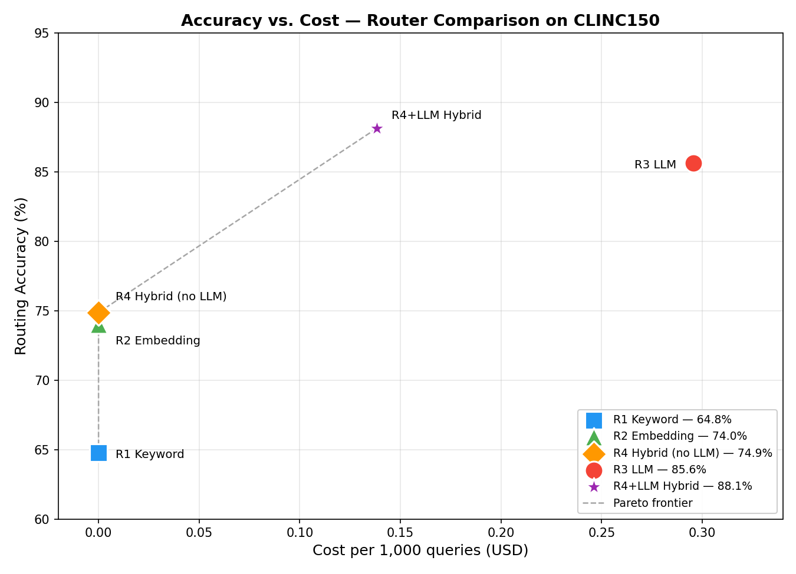

# Cost-Aware Hybrid Router for LLM Agent Systems

> A keyword → embedding → LLM cascade that matches full-LLM routing accuracy while calling the LLM on only ~26% of queries on CLINC150 (3 seeds, McNemar-tested, tuned thresholds).
>
> 透過 keyword → embedding → LLM 三層 cascade，在 CLINC150 上達到與全量 LLM 路由統計上相當的準確率，但只對約 26% 的查詢呼叫 LLM（3 seeds、經過 McNemar 檢定、閾值已調參）。

[](https://opensource.org/licenses/MIT)
[](https://www.python.org/downloads/)
[](https://huggingface.co/datasets/clinc_oos)

---

## TL;DR / 一句話

**EN:** Production agent frameworks (AutoGen, CrewAI, LangGraph) typically route every query through an LLM. This repo evaluates an alternative: a keyword → embedding → LLM cascade with tuned thresholds. Across 3 seeds on CLINC150, the cascade matches full-LLM routing accuracy (**82.6% ± 1.2pp vs 82.9% ± 0.6pp**) while calling the LLM on only **26.1% ± 1.7pp** of queries — a **74% reduction in LLM cost** per routed query ($0.030 vs $0.117 per 400-query seed). **McNemar's exact test finds no significant difference in any of the 3 seeds** (p = 1.000, 0.371, 0.755). The cascade matches LLM accuracy at a fraction of the cost, but does not exceed it.

**中:** 主流 agent 框架（AutoGen、CrewAI、LangGraph）通常讓每一筆查詢都經過 LLM 路由。本 repo 評估另一條路：keyword → embedding → LLM 三層 cascade，閾值已在 validation set 上調參。跨 3 個 seed 在 CLINC150 上，cascade 與全量 LLM 路由的準確率相當（**82.6% ± 1.2pp vs 82.9% ± 0.6pp**），但只對 **26.1% ± 1.7pp** 的查詢呼叫 LLM — 每筆查詢的 **LLM 成本降低 74%**（每 seed 400 筆查詢：$0.030 vs $0.117）。**McNemar 精確檢定在 3 個 seed 中都沒有顯著差異**（p = 1.000、0.371、0.755）。Cascade 達到 LLM 水準的準確率，但不會超越。

---

## Results / 實驗結果

**Evaluated on CLINC150 test set (5,500 queries, 150 intents mapped to 7 agents + OOS):**

**在 CLINC150 測試集上評估（5,500 筆查詢，150 個 intent 映射到 7 個 agent + OOS）：**

| Router | Accuracy / 準確率 | Sample Size / 樣本 | LLM Call Rate / LLM 呼叫率 | Cost per seed (USD) / 每 seed 成本 |
|---|---|---|---|---|
| R1 Keyword (regex rules) | 64.8% | n = 5,500 (full test) | 0% | $0 |
| R2 Embedding (TF-IDF centroid) | 74.0% | n = 5,500 (full test) | 0% | $0 |
| SetFit baseline (16-shot, contrastive) | 70.2% | n = 5,500 (full test) | 0% | $0 (local) |
| R4 Hybrid cascade (no LLM) | 74.9% | n = 5,500 (full test) | 0% | $0 |
| R3 LLM (Claude Haiku zero-shot) | **82.9% ± 0.6pp** | n = 400 × 3 seeds | 100% | $0.117 |
| **R4 Hybrid cascade (with LLM)** | **82.6% ± 1.2pp** | **n = 400 × 3 seeds** | **26.1% ± 1.7pp** | **$0.030** |

**Statistical validation (pooled across 3 seeds, n = 1,200):**

- **Wilson 95% CI** — R3 LLM: [80.7%, 84.9%] · R4 Hybrid+LLM: [80.3%, 84.6%] (overlapping)
- **McNemar's exact binomial test** (paired, on identical shared samples per seed) — **0/3 seeds significant** at α=0.05: p = 1.000, 0.371, 0.755; deltas = +0.00pp, −1.75pp, +0.75pp
- **Tuned thresholds** (grid search on validation set, see `results/tuned_thresholds.json`): with-LLM cascade uses kt=0.5, et=0.10; no-LLM cascade uses kt=1.5, et=0.05
- **Total evaluation cost:** $0.44 across 3 seeds

**統計驗證（3 個 seed pooled，n = 1,200）：**

- **Wilson 95% 信賴區間** — R3 LLM: [80.7%, 84.9%]、R4 Hybrid+LLM: [80.3%, 84.6%]（區間重疊）
- **McNemar 精確二項檢定**（配對，每 seed 在相同樣本上比較）— α=0.05 下 **3 個 seed 都不顯著**: p = 1.000、0.371、0.755; deltas = +0.00pp、−1.75pp、+0.75pp
- **調參後閾值**（在 validation set 上 grid search，詳見 `results/tuned_thresholds.json`）：with-LLM cascade 用 kt=0.5、et=0.10；no-LLM cascade 用 kt=1.5、et=0.05
- **總評估成本：** 3 個 seed 合計 $0.44



---

## Quick Start / 快速開始

### 1. Clone & install / 安裝

```bash
git clone https://github.com/drewOrc/cost-aware-hybrid-router.git
cd cost-aware-hybrid-router
pip install -r requirements.txt
```

### 2. Download dataset / 下載資料集

```bash
python download_data.py
```

This downloads CLINC150 from HuggingFace `clinc_oos` (plus variant) and saves the train/validation/test splits as JSON under `data/clinc150/`.

此指令會從 HuggingFace 的 `clinc_oos` (plus variant) 下載 CLINC150，並將 train/validation/test 資料存成 JSON 於 `data/clinc150/` 底下。

### 3. Set API key (only needed for R3/R4-with-LLM) / 設定 API key（只有 R3 和 R4+LLM 需要）

```bash
export ANTHROPIC_API_KEY=sk-ant-...
```

You can get a key at https://console.anthropic.com/ — the full 3-seed evaluation uses ~$0.45 of Haiku credits.

可以在 https://console.anthropic.com/ 申請 API key，跑完整 3-seed 評估約使用 Haiku 點數 $0.45 美元。

### 4. (Optional) Tune thresholds on validation set / (選用) 在 validation set 上調參

```bash
PYTHONPATH=. python3 src/tune.py
```

Runs a grid search over `keyword_threshold` and `embed_threshold` on the CLINC150 validation split and writes `results/tuned_thresholds.json`. The default tuned values are already committed, so this step is only needed if you want to re-tune.

在 CLINC150 validation split 上對 `keyword_threshold` 與 `embed_threshold` 做 grid search，結果寫入 `results/tuned_thresholds.json`。預設的調參結果已經 commit，只有要重新調參時才需要跑這步。

### 5. Run 3-seed parallel evaluation / 執行 3-seed 平行評估

```bash
# zero-cost routers (R1, R2, R4-no-LLM, SetFit) — run once
PYTHONPATH=. python3 src/evaluate.py --no-llm

# LLM + hybrid-with-LLM cascade — 3 seeds, parallel (ThreadPoolExecutor, 6 workers)
for seed in 42 43 44; do
  PYTHONPATH=. python3 src/evaluate_llm_parallel.py --seed $seed --n-per-agent 50
done

# merge seeds, compute mean ± std, Wilson CI, McNemar
PYTHONPATH=. python3 src/merge_seeds.py
```

Per-seed files are written to `results/metrics_seed{42,43,44}.json`; the merged summary lives in `results/metrics_merged.json`. Each seed takes ~7–8 minutes (rate-limited to Haiku's 50 RPM with exponential backoff).

每個 seed 的結果寫入 `results/metrics_seed{42,43,44}.json`，合併後的總結在 `results/metrics_merged.json`。每個 seed 約需 7–8 分鐘（受 Haiku 50 RPM 限制，含指數退避重試）。

### 6. Generate figures / 產生圖表

```bash
PYTHONPATH=. python3 src/sync_metrics.py   # flatten merged metrics for plotting
PYTHONPATH=. python3 src/analysis.py
```

Writes three plots to `results/figures/`:
- `accuracy_vs_cost.png` — Pareto frontier scatter plot
- `per_agent_accuracy.png` — per-agent accuracy comparison
- `hybrid_flow.png` — query flow distribution through the cascade

輸出三張圖到 `results/figures/`：
- `accuracy_vs_cost.png` — Pareto frontier 散佈圖
- `per_agent_accuracy.png` — 各 agent 準確率比較
- `hybrid_flow.png` — cascade 中查詢的流向分佈

---

## Architecture / 架構

```
Query ─┐
       ▼
   ┌────────────┐
   │ R1 Keyword │  confidence ≥ threshold? ──► YES → return
   │  (regex)   │                                NO ↓
   └────────────┘
                                                  ▼
                                        ┌────────────────┐
                                        │ R2 Embedding   │  confidence ≥ threshold? ──► YES → return
                                        │ (TF-IDF cosim) │                                NO ↓
                                        └────────────────┘
                                                                                           ▼
                                                                               ┌────────────────┐
                                                                               │ R3 LLM (Haiku) │ ──► return
                                                                               │   (zero-shot)  │
                                                                               └────────────────┘
```

**Thresholds** are tuned on the CLINC150 validation split via grid search in `src/tune.py`. The with-LLM cascade uses `keyword_threshold=0.5`, `embed_threshold=0.10` (more queries cascade down to LLM fallback); the no-LLM cascade uses `keyword_threshold=1.5`, `embed_threshold=0.05` (more permissive routing since there's no fallback). Tuning output lives in `results/tuned_thresholds.json` and is fully reproducible from the validation set.

**閾值**在 CLINC150 的 validation split 上透過 `src/tune.py` 的 grid search 調參。with-LLM cascade 使用 `keyword_threshold=0.5`、`embed_threshold=0.10`（讓更多查詢 cascade 到 LLM fallback）；no-LLM cascade 使用 `keyword_threshold=1.5`、`embed_threshold=0.05`（因為沒有 fallback，路由較寬鬆）。調參結果存在 `results/tuned_thresholds.json`，可從 validation set 完全重現。

---

## Why This Matters / 為什麼這個結果重要

### The main claim / 主張

The cascade **matches** full-LLM accuracy (82.6% ± 1.2pp vs 82.9% ± 0.6pp, no McNemar-significant difference in any seed) while calling the LLM on only ~26% of queries. That is the entire point: LLM cost can be cut by ~74% without sacrificing routing accuracy.

Cascade 達到與全量 LLM 相同的準確率（82.6% ± 1.2pp vs 82.9% ± 0.6pp，每個 seed 的 McNemar 都不顯著），同時只對 ~26% 的查詢呼叫 LLM。重點就在這：LLM 成本可以砍掉 ~74%，同時不犧牲路由準確率。

**EN:** Keyword and embedding routers are *cheaper and cautious*. When a query strongly matches keyword patterns (e.g., "transfer $500 to my savings account"), keyword is confident and correct. When keyword is uncertain, embedding takes a shot; when embedding is also uncertain, the cascade invokes the LLM. The LLM therefore only runs on the ~26% of queries where cheap routers abstained — exactly the queries where LLM reasoning is worth paying for. Full-LLM routing, by contrast, runs the LLM on all 100% of queries, paying for the 74% where a free router would have been correct already. The accuracy tradeoff is statistically zero on CLINC150.

**中:** Keyword 和 embedding router **便宜而且謹慎**。當查詢強匹配 keyword 樣式（例如「轉 500 美元到我的儲蓄帳戶」）時，keyword 有信心而且答對。當 keyword 不確定，由 embedding 接手；當 embedding 也不確定，cascade 才呼叫 LLM。所以 LLM 只在 ~26% 的查詢（便宜 router 棄權的那些）上執行 — 正是 LLM 推理值得付費的查詢。相反地，Full-LLM 路由對全部 100% 的查詢都跑 LLM，等於為 74% 本來就能免費答對的查詢付費。在 CLINC150 上的準確率取捨在統計上為零。

### Failure mode taxonomy / 失敗模式分類

| Type | Symptom | Who suffers | Fix |
|---|---|---|---|
| **A — Keyword coverage gap** | Query defaults to OOS when no pattern matches | Meta, device, productivity agents (36–66% misrouted to OOS) | Fallthrough to embedding or LLM |
| **B — Cross-agent semantic overlap** | TF-IDF centroids confuse similar domains | "productivity" vs "meta" (shared vocab: remind, schedule, note) | LLM stage disambiguates |
| **C — Embedding OOS blindness** | Centroids project every query onto *some* agent | OOS accuracy: 26% (embedding) vs 80% (keyword) | Keep keyword's fail-closed OOS default |

| 類型 | 症狀 | 誰受影響 | 解法 |
|---|---|---|---|
| **A — Keyword 覆蓋缺口** | 沒匹配到樣式就預設 OOS | meta、device、productivity agent（36–66% 誤路由到 OOS） | fallthrough 到 embedding 或 LLM |
| **B — 跨 agent 語意重疊** | TF-IDF centroid 搞混相近領域 | 「productivity」vs「meta」（共享詞彙：提醒、排程、筆記） | LLM 階段消除歧義 |
| **C — Embedding OOS 盲點** | Centroid 將每筆查詢投射到某個 agent | OOS 準確率：26%（embedding）vs 80%（keyword） | 保留 keyword 的 fail-closed OOS 預設 |

---

## Folder Structure / 檔案結構

```
cost-aware-hybrid-router/
├── README.md
├── DEVLOG.md                        ← running experiment log
├── RUN_UPGRADED.md                  ← upgraded eval runbook (3 seeds + McNemar)
├── LICENSE                          ← MIT
├── requirements.txt
├── download_data.py                 ← download CLINC150 from HuggingFace
├── data/
│   ├── clinc150/                    ← raw data (gitignored; run download_data.py)
│   └── intent_to_agent.json         ← 150 intents → 7 agents + OOS mapping
├── src/
│   ├── routers/
│   │   ├── keyword_router.py        ← R1: weighted regex patterns
│   │   ├── embedding_router.py      ← R2: TF-IDF + cosine similarity
│   │   ├── llm_router.py            ← R3: Claude Haiku zero-shot
│   │   ├── hybrid_router.py         ← R4: cascade
│   │   └── setfit_router.py         ← SetFit 16-shot contrastive baseline
│   ├── train_setfit.py              ← train SetFit on CLINC150 train split
│   ├── tune.py                      ← grid search for thresholds on val set
│   ├── evaluate.py                  ← zero-cost routers + SetFit
│   ├── evaluate_llm_parallel.py     ← LLM + hybrid-with-LLM (parallel, per seed)
│   ├── merge_seeds.py               ← aggregate seeds → mean ± std, CI, McNemar
│   ├── sync_metrics.py              ← flatten merged metrics for analysis.py
│   ├── stats.py                     ← Wilson CI + McNemar exact binomial
│   └── analysis.py                  ← generate figures
└── results/
    ├── tuned_thresholds.json        ← grid-search output
    ├── metrics_seed{42,43,44}.json  ← per-seed LLM + cascade results
    ├── metrics_no_llm_baseline.json ← zero-cost routers + SetFit
    ├── metrics_merged.json          ← aggregated with CI + McNemar
    ├── metrics.json                 ← flattened for legacy analysis.py
    └── figures/
        ├── accuracy_vs_cost.png
        ├── per_agent_accuracy.png
        └── hybrid_flow.png
```

---

## Reproducibility / 可重現性

- **Fixed seeds** for stratified sampling (seeds = 42, 43, 44)
- **Temperature=0** for Claude API calls
- **Frozen test set** — same 5,500 queries across all zero-cost routers
- **Identical shared samples per seed** — R3 and R4-with-LLM score the same queries, enabling a paired McNemar test rather than two independent samples
- **Thresholds tuned on validation split only** — no test-set leakage
- **All dependencies pinned** in `requirements.txt`

- **分層抽樣使用固定 seeds**（seeds = 42、43、44）
- **Claude API 呼叫 temperature=0**
- **凍結的測試集** — 零成本 router 跑同樣的 5,500 筆
- **每個 seed 使用相同的配對樣本** — R3 與 R4+LLM 對同一批查詢評分，這使 McNemar 配對檢定（而非兩個獨立樣本）成為可能
- **閾值只在 validation split 上調參** — 無測試集洩漏
- **所有相依套件鎖定版本**於 `requirements.txt`

---

## Limitations / 研究限制

The 3-seed evaluation with McNemar testing resolved the statistical issues of the original exploratory run, but several real limitations remain:

3-seed 評估加上 McNemar 檢定解決了初版實驗的統計問題，但仍有幾個真實限制：

1. **Single dataset, single LLM model.** Evaluated only on CLINC150 (English, commercial domains) with only Claude Haiku. Generalization to other datasets (BANKING77, HWU64), languages, or LLMs is untested. The cascade's relative advantage depends on how well keyword/embedding stages cover the domain, and CLINC150's 150 commercial intents may be unusually well-suited to pattern matching.

   **單一資料集、單一 LLM 模型。** 僅在 CLINC150（英文、商業領域）上、僅以 Claude Haiku 評估。對其他資料集（BANKING77、HWU64）、語言或 LLM 的泛化能力尚未驗證。Cascade 的相對優勢取決於 keyword/embedding 階段對領域的覆蓋程度，CLINC150 的 150 個商業 intent 可能特別適合 pattern matching。

2. **LLM accuracy itself is the ceiling (~83%).** Claude Haiku zero-shot caps at 82.9% — the cascade can at best match this, not exceed it. Methods that fine-tune an LLM on the CLINC150 train split (or use retrieval-augmented few-shot prompting) could push the ceiling higher, and the cascade's cost advantage would need to be re-evaluated against those stronger baselines.

   **LLM 本身準確率（~83%）就是天花板。** Claude Haiku zero-shot 在 82.9% 達到頂。Cascade 最多只能達到這個水準，無法超越。在 CLINC150 train split 上 fine-tune 的 LLM（或 RAG + few-shot prompting）可以把天花板推高，屆時 cascade 的成本優勢需要對上那些更強的 baseline 重新評估。

3. **OOS detection relies on keyword's fail-closed default.** On the full test set, embedding routing only gets ~26% on OOS queries while keyword gets 80%. The cascade inherits keyword's OOS handling, but this is a brittle design — any dataset where OOS queries *don't* trivially fail keyword patterns would break this. A principled OOS detector (confidence thresholding on a calibrated classifier) would be more robust.

   **OOS 偵測仰賴 keyword 的 fail-closed 預設。** 在完整測試集上，embedding routing 對 OOS 查詢只達 ~26%，而 keyword 是 80%。Cascade 繼承了 keyword 的 OOS 處理方式，但這是脆弱的設計 — 如果資料集的 OOS 查詢不會很自然地被 keyword 擋掉，這個機制就會失效。有原則的 OOS 偵測器（校正後分類器的信心閾值）會更穩健。

4. **R4-no-LLM (74.9%) is already surprisingly close.** The zero-cost cascade reaches 74.9% without any LLM, which is a separate and arguably more interesting result: for cost-sensitive deployments that can tolerate ~8pp lower accuracy than full-LLM, no LLM is needed at all. The 8pp gap might itself shrink with a stronger free baseline (e.g., fine-tuned DistilBERT).

   **R4-no-LLM（74.9%）已經出乎意料地接近。** 零成本 cascade 完全不用 LLM 就達到 74.9%，這本身是另一個有意思的結果：對於成本敏感、能容忍比全 LLM 低 ~8pp 準確率的部署，根本不需要 LLM。這 8pp 的差距用更強的零成本 baseline（例如 fine-tune 過的 DistilBERT）可能還會再縮小。

5. **Threshold sensitivity not characterized.** Thresholds were tuned on the validation split but the accuracy/cost tradeoff curve as a function of `(kt, et)` has not been reported. A practitioner deploying this can't yet read off "if I'm willing to pay X, here's the accuracy I get".

   **閾值敏感度未作系統分析。** 閾值在 validation split 上調過參，但準確率/成本權衡曲線對 `(kt, et)` 的函數關係尚未呈現。要部署這套系統的工程師目前還無法從「我願意付多少錢 → 能拿到多少準確率」的角度查表。

### Next steps / 下一步

- Cross-dataset validation on **BANKING77** (77 fine-grained banking intents) and **HWU64** (64 intents across 21 domains).
- Ablate the cascade: what's the cost/accuracy curve at `et = 0.05, 0.10, 0.15, 0.20`?
- Replace OOS fail-closed default with a calibrated confidence threshold.
- Add a fine-tuned DistilBERT baseline on CLINC150 train split to see how far a single small model can go.

- 在 **BANKING77**（77 個細粒度銀行 intent）和 **HWU64**（21 個領域、64 個 intent）上做跨資料集驗證。
- 對 cascade 做 ablation：`et = 0.05、0.10、0.15、0.20` 時的成本/準確率曲線？
- 把 OOS fail-closed 預設換成校正後的信心閾值。
- 加入在 CLINC150 train split 上 fine-tune 的 DistilBERT baseline，看單一小模型能走多遠。

---

## Citation / 引用

If you find this useful, please cite: / 如果對您有幫助，請引用：

```bibtex
@misc{chen2026hybrid,
  author = {Chen, Boyu},
  title  = {Cost-Aware Hybrid Router for LLM Agent Systems},
  year   = {2026},
  url    = {https://github.com/drewOrc/cost-aware-hybrid-router}
}
```

---

## License / 授權

MIT License — see [LICENSE](LICENSE).

---

## Author / 作者

**Boyu Chen (陳柏宇)** — AI Engineer — [GitHub](https://github.com/drewOrc)

