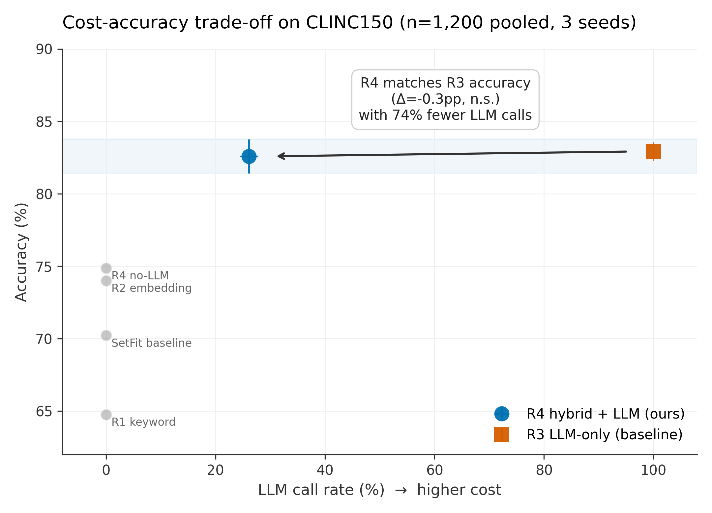
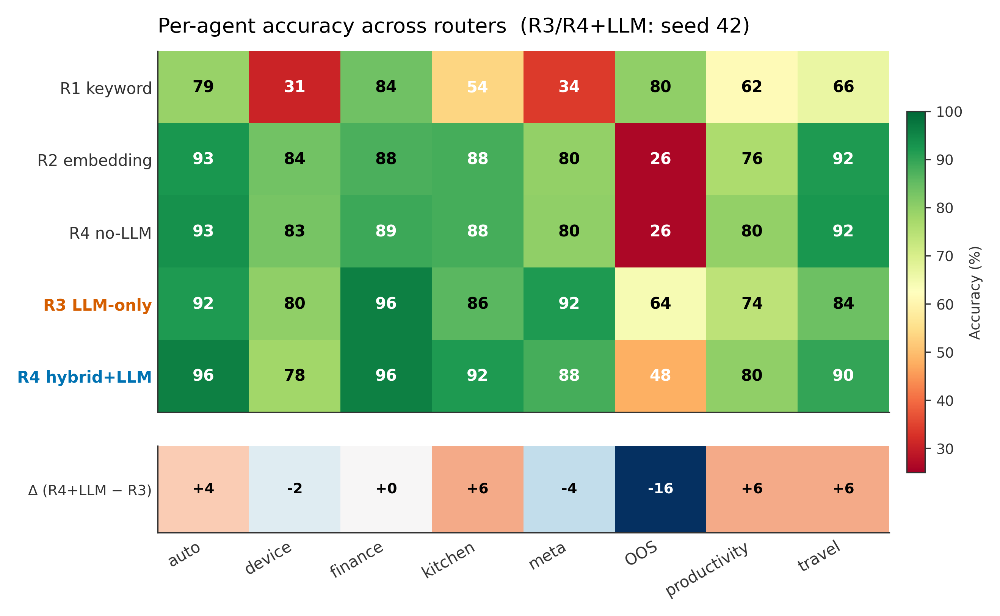

# Cost-Aware Hybrid Router for LLM Agent Systems

A keyword → embedding → LLM cascade that matches full-LLM routing accuracy while calling the LLM on only ~26% of queries on CLINC150.

[](https://opensource.org/licenses/MIT)
[](https://www.python.org/downloads/)
[](https://huggingface.co/datasets/clinc_oos)

[中文版 README](README_zh.md)

---

## Key Result

Production agent frameworks (AutoGen, CrewAI, LangGraph) typically route every query through an LLM. This repo evaluates a cheaper alternative: a confidence-gated keyword → embedding → LLM cascade. Across 3 seeds on CLINC150, the cascade matches full-LLM routing accuracy (**82.6% ± 1.2pp vs 82.9% ± 0.6pp**) while calling the LLM on only **26.1%** of queries — a **74% reduction in LLM cost**. McNemar's exact test finds no significant difference in any seed (p = 1.000, 0.371, 0.755).

| Router | Accuracy | LLM Call Rate | Cost / seed |
|---|---|---|---|
| R1 Keyword | 64.8% | 0% | $0 |
| R2 Embedding (MPNet centroid) | 74.0% | 0% | $0 |
| SetFit baseline (16-shot) | 70.2% | 0% | $0 |
| R4 Cascade no-LLM | 74.9% | 0% | $0 |
| R3 LLM-only (Haiku 4.5) | **82.9% ± 0.6pp** | 100% | $0.117 |
| **R4 Cascade + LLM** | **82.6% ± 1.2pp** | **26.1%** | **$0.030** |

Evaluated on CLINC150 test set (5,500 queries, 150 intents → 7 agents + OOS). LLM rows: 3 seeds × 400 stratified queries (pooled n=1,200).



---

## Architecture

```
Query ──► R1 Keyword ──[high confidence]──► return prediction
               │
               ▼ (low confidence)
          R2 Embedding ──[high confidence]──► return prediction
               │
               ▼ (low confidence)
          R3 LLM (Haiku 4.5) ──► return prediction
```

Thresholds tuned on CLINC150 validation split via grid search (`src/tune.py`). With-LLM cascade: `kt=0.5, et=0.10`. Results in `results/tuned_thresholds.json`.

---

## Quick Start

```bash
# Clone & install
git clone https://github.com/drewOrc/cost-aware-hybrid-router.git
cd cost-aware-hybrid-router
pip install -r requirements.txt

# Download CLINC150 (required before any evaluation)
python download_data.py

# Run zero-cost routers (R1, R2, R4 no-LLM) — no API key needed
PYTHONPATH=. python3 src/evaluate.py --use-tuned-thresholds

# Run LLM evaluation (requires Anthropic API key, ~$0.44 total)
export ANTHROPIC_API_KEY=sk-ant-...
PYTHONPATH=. python3 src/evaluate_llm_parallel.py \
  --llm-n 400 --seeds 42 43 44 --workers 6 --use-tuned-thresholds

# Merge seeds → mean ± std, Wilson CI, McNemar
PYTHONPATH=. python3 src/merge_seeds.py

# Generate paper-grade figures
python paper/figures.py

# Optional: reproduce SetFit baseline (requires extra dependencies)
# pip install setfit sentence-transformers
# PYTHONPATH=. python3 src/evaluate.py --setfit --use-tuned-thresholds
```

---

## Statistical Validation

- **Wilson 95% CI** — R3: [80.7%, 84.9%], R4+LLM: [80.3%, 84.6%] (overlapping)
- **McNemar's exact binomial** — 0/3 seeds significant at α=0.05
- **Paired evaluation** — R3 and R4 score identical queries per seed
- **Thresholds tuned on validation split only** — no test-set leakage

---

## Paper

Workshop paper (ACL two-column format) and publication-quality figures are in [`paper/`](paper/):

- [`acl_paper.pdf`](paper/acl_paper.pdf) — Submission-ready PDF (compiled from LaTeX)
- [`acl_paper.tex`](paper/acl_paper.tex) — LaTeX source
- [`figures.py`](paper/figures.py) — Reproducible figure generator (5 figures, 300 DPI)



---

## Folder Structure

```
cost-aware-hybrid-router/
├── README.md / README_zh.md
├── LICENSE (MIT)
├── requirements.txt
├── download_data.py
├── data/
│   ├── clinc150/              ← raw data (gitignored; run download_data.py)
│   └── intent_to_agent.json   ← 150 intents → 7 agents + OOS
├── src/
│   ├── routers/               ← R1 keyword, R2 embedding, R3 LLM, R4 cascade, SetFit
│   ├── tune.py                ← threshold grid search on validation set
│   ├── evaluate.py            ← zero-cost router evaluation
│   ├── evaluate_llm_parallel.py ← LLM + cascade (parallel, multi-seed)
│   ├── merge_seeds.py         ← aggregate → mean ± std, Wilson CI, McNemar
│   └── stats.py               ← Wilson CI + McNemar exact binomial
├── results/
│   ├── tuned_thresholds.json
│   ├── metrics_seed{42,43,44}.json
│   ├── metrics_merged.json    ← primary results file
│   └── figures/
└── paper/
    ├── acl_paper.tex/pdf
    ├── Cost-Aware_Hybrid_Routing_Paper.docx/pdf
    ├── figures.py
    └── figures/F1-F5.png
```

---

## Limitations

1. **Single benchmark** (CLINC150). Generalisation to BANKING77, HWU64, or non-English datasets is untested.
2. **LLM ceiling is ~83%.** The cascade matches but cannot exceed Haiku zero-shot. Fine-tuned or few-shot LLMs would raise the bar.
3. **Static thresholds.** No online adaptation or per-user personalisation.
4. **OOS detection is brittle.** Relies on keyword fail-closed default; a calibrated OOS detector would be more robust.
5. **Threshold sensitivity not characterised.** The cost/accuracy curve over the full `(kt, et)` grid is not reported.

---

## Reproducibility

- Fixed seeds: 42, 43, 44
- Temperature = 0 for all LLM calls
- Thresholds tuned on validation split only
- All dependencies pinned in `requirements.txt`
- Total API cost to reproduce: **$0.44**

---

## Citation

```bibtex
@misc{chen2026hybrid,
  author = {Chen, Bo-Yu},
  title  = {Cost-Aware Hybrid Router for LLM Agent Systems},
  year   = {2026},
  url    = {https://github.com/drewOrc/cost-aware-hybrid-router}
}
```

---

## License

MIT — see [LICENSE](LICENSE).

**Bo-Yu Chen** — University of Texas at San Antonio — [GitHub](https://github.com/drewOrc)
