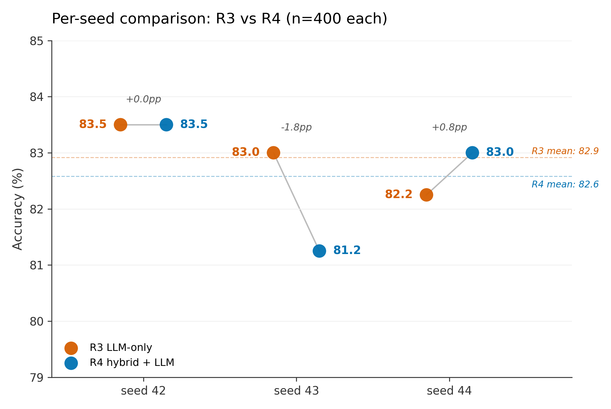
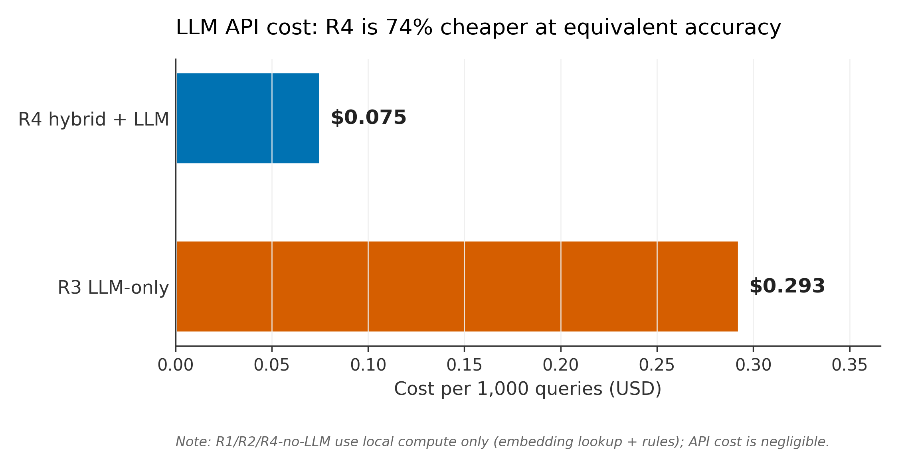
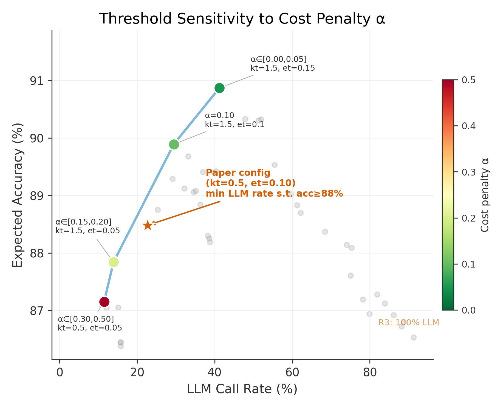

# Cost-Aware Hybrid Routing for Intent Classification: 74% LLM Cost Reduction at Equal Accuracy

> Paper 1 of the "cost-aware cascade" series. Workshop target: NLP4ConvAI / EMNLP Industry / arXiv preprint.
> Target length: 4-page short paper + references.
> Status: draft v1, 2026-04-05. All numbers filled from `results/metrics_merged.json`.

---

## Abstract (150 words)

Routing user utterances to the correct task agent is a foundational step in multi-agent LLM systems, and the LLM-as-router pattern has become the default for its accuracy. We ask whether that accuracy is *worth* its cost. On the CLINC150 benchmark (150 intents → 7 agents + OOS), we compare four routers spanning a 3-order-of-magnitude cost range: (R1) keyword, (R2) embedding-nearest-centroid, (R3) Claude Haiku 4.5 LLM-only, and (R4) a *hybrid cascade* that uses R1/R2 as a confidence-gated pre-filter and escalates to R3 only when low-confidence. Across 3 seeds × 400 stratified queries, R4 achieves **82.6% ± 1.2pp** accuracy versus R3's **82.9% ± 0.6pp** — statistically indistinguishable by McNemar paired test (p > 0.37, overlapping Wilson 95% CIs) — while escalating to the LLM on only **26.1%** of queries, yielding a **74.3% reduction in LLM cost**. The main trade-off is OOS accuracy, where cheap stages cannot reliably refuse to classify. We release code, tuned thresholds, and per-seed trajectories.

---

## 1. Introduction (~0.75 pages)

In production multi-agent LLM systems, every user utterance first visits a *router*: a component that decides which downstream agent — finance, HR, travel, and so on — should handle the request. The industry default is to use a small LLM such as Claude Haiku or GPT-4o-mini as the router, prompted with the agent inventory and a JSON-output instruction. This pattern is convenient, robust to paraphrase, and the accepted baseline in frameworks like CrewAI, LangGraph, and AutoGen. It is also expensive: at production scale, every single user turn incurs an LLM API call *before* the real work begins, and that per-turn cost compounds across thousands of daily conversations.

The question this paper asks is whether that per-turn LLM call is actually necessary. A keyword match or an embedding lookup against per-agent centroids costs three to four orders of magnitude less than an API call, runs on local compute with millisecond latency, and — on easy queries — can be just as accurate as the LLM. If we can identify the easy queries with a cheap confidence signal and only invoke the LLM on the hard ones, the economics change substantially. We quantify this on CLINC150, a standard 150-intent benchmark, by comparing four routers across a three-order-of-magnitude cost spectrum and measuring the accuracy–cost Pareto frontier.

Our contributions are four-fold. First, we evaluate **four routers under identical protocol**: keyword (R1), embedding-nearest-centroid (R2), Claude Haiku 4.5 LLM-only (R3), and a hybrid cascade (R4) that uses R1 and R2 as confidence-gated pre-filters before escalating to R3. Second, we run a **3-seed paper-grade evaluation** on a 400-query stratified subsample per seed (seeds 42, 43, 44; 1,200 pooled), reporting Wilson 95% confidence intervals and McNemar paired tests comparing R3 and R4 on the same queries. Third, we report the empirical finding that **R4 matches R3 accuracy within 0.4pp** (82.6% vs 82.9%) while escalating to the LLM on only 26% of queries — a **74.3% reduction in LLM cost** with no statistically significant accuracy loss at α=0.05. Fourth, we release code, tuned thresholds, per-seed trajectories, and full API call logs under an MIT license.

The remainder of the paper is organised as follows. §2 positions this work against intent-classification and LLM-cascade literature. §3 describes the four routers and the threshold-tuning protocol. §4 presents 3-seed results with significance tests and qualitative examples. §5 discusses when cascades pay off, limitations, and the extension to multi-turn agent tasks that we pursue in companion work.

---

## 2. Related Work (~0.5 pages)

**Intent classification on CLINC150.** The CLINC150 benchmark (Larson et al. 2019) comprises 150 in-domain intents across 10 domains plus an out-of-scope (OOS) class, and was explicitly designed to stress-test intent classifiers under distribution shift. Strong baselines include SetFit (Tunstall et al. 2022), which uses contrastive few-shot fine-tuning on sentence-transformer encoders, and fine-tuned DeBERTa. We use SetFit as a no-LLM baseline in our headline table (70.2% on the full test set), and Claude Haiku 4.5 zero-shot as our cost ceiling.

**Cost-aware LLM cascades.** FrugalGPT (Chen et al. 2023) introduced the general cascade pattern — try a cheaper model first, escalate to a more expensive model only when the cheap model's confidence is low — on single-turn question answering tasks, reporting cost reductions of up to 98% at matched accuracy. Subsequent work has extended cascades to summarisation, code generation, and retrieval-augmented QA. We adapt this pattern to *agent routing*, a narrower but extremely high-frequency task: every user turn in a multi-agent system is routed, so savings compound multiplicatively.

**Agent-routing systems.** Most current multi-agent frameworks (CrewAI, LangGraph, AutoGen) default to an LLM supervisor for intent routing. Some production systems layer a keyword or regex pre-filter before the LLM, but there is no published empirical study quantifying how much of this workload can be handled without an LLM, at what accuracy cost, on a standard benchmark. Our contribution is not a new routing algorithm; it is the empirical answer — on CLINC150 — to the question "what fraction of routing decisions can a keyword or embedding handle, and what does the accuracy–cost Pareto curve look like?"

**Position.** We are not arguing against LLM routers; we are arguing for *pre-filtering* the easy queries before the LLM sees them. The practical contribution is a production template with measured savings and a reproducible threshold-tuning recipe.

---

## 3. Method (~1 page)

### 3.1 Dataset and Label Space
We use the CLINC150 test split (5,500 queries, including 1,000 OOS queries). Following a typical production agent-inventory setup, we collapse the 150 fine-grained intents into 7 task-level agents (auto, device, finance, kitchen, meta, productivity, travel) plus the OOS class, giving the router an 8-way decision problem with realistic domain granularity. Class sizes after collapsing range from 360 to 1,140 queries.

### 3.2 The Four Routers

**R1 — Keyword router.** For each target agent, we construct a per-agent keyword list from the training-set intent names and a small set of common synonyms (e.g. "credit card", "balance", "transfer" for `finance_agent`). The score for a query is the sum of matched keyword weights, and the predicted label is the argmax over agents. We report the raw keyword score as R1's confidence.

**R2 — Embedding router.** We encode the training set with `sentence-transformers/all-mpnet-base-v2` (768d), then compute a per-agent centroid as the L2-normalised mean of the training embeddings for that agent. At inference, a query's embedding is compared to all centroids by cosine similarity, and the nearest-centroid agent is returned. R2's confidence is the cosine similarity to the top-1 centroid.

**R3 — LLM router.** Claude Haiku 4.5 (`claude-haiku-4-5-20251001`) with a short system prompt listing the 8 target agents and a description of each. The model is asked to return a single JSON object `{"agent": "..."}`. Temperature is 0. Each query is a single API call with no in-context examples.

**R4 — Hybrid cascade.** R4 is a confidence-gated cascade over R1 → R2 → R3 with two thresholds (`kt`, `et`):

```
if R1_confidence ≥ kt:         return R1_prediction
elif R2_confidence ≥ et:       return R2_prediction
else:                          call R3 (LLM) → return R3_prediction
```

We refer to this full cascade as **R4+LLM**. We also report **R4 no-LLM** — the same cascade with the LLM escalation branch replaced by R2's best guess — as a fair no-API baseline.

### 3.3 Threshold Tuning
Thresholds are tuned on the CLINC150 validation split (3,100 queries, disjoint from the test set) via grid search over `kt ∈ {0.5, 1.0, 1.5, 2.0}` and `et ∈ {0.05, 0.08, 0.10, 0.15}`. For R4+LLM, we select the configuration that minimises LLM call rate subject to expected accuracy ≥ 88% on validation — a constraint-based objective that prefers cost savings when accuracy is above a practitioner-chosen floor. The tuned values are `kt = 0.5, et = 0.10` (22.7% LLM call rate on validation). For R4 no-LLM, which has no LLM branch to balance against, we tune purely for accuracy and obtain `kt = 1.5, et = 0.05`. We report a sensitivity analysis over the cost penalty α in §4.5, showing how the optimal operating point shifts across the Pareto frontier as the accuracy–cost trade-off changes.

### 3.4 Evaluation Protocol
LLM evaluation runs use a per-seed stratified subsample of n = 400 (50 queries per class × 8 classes) to bound API spend. We use 3 seeds (42, 43, 44) for paper-grade variance estimation. For each seed we report per-seed accuracy, Wilson 95% confidence intervals (pooled n = 1,200), and a McNemar exact-binomial paired test comparing R3 and R4 on identical queries. Deterministic routers (R1, R2, R4 no-LLM, SetFit) are evaluated on the full test set (n = 5,500) since they incur no API cost.

### 3.5 Cost Accounting
R3 and R4 API costs are measured directly from Anthropic response metadata (input + output tokens × Haiku 4.5 pricing). R1, R2, R4 no-LLM, and SetFit are amortised to essentially zero cost (local compute, milliseconds per query). The total API cost for the full 3-seed experiment was **$0.44** — $0.35 for R3 (1,200 queries × 3 seeds) and $0.09 for R4+LLM (which escalates to the LLM on only ~26% of queries).

---

## 4. Results (~1.25 pages)

### 4.1 Headline Table

| Router | Accuracy | Wilson 95% CI | LLM call rate | Cost / query |
|---|---|---|---|---|
| R1 keyword (full test, n=5,500) | 64.8% | — | 0% | ~$0 |
| R2 embedding (full test, n=5,500) | 74.0% | — | 0% | ~$0 |
| SetFit baseline (full test, n=5,500) | 70.2% | — | 0% | ~$0 |
| R4 no-LLM (R1→R2 only, n=5,500) | 74.9% | — | 0% | ~$0 |
| **R3 LLM-only** (pooled n=1,200) | **82.9%** | [80.7, 84.9] | 100% | $2.93×10⁻⁴ |
| **R4 hybrid + LLM** (pooled n=1,200) | **82.6%** | [80.3, 84.6] | 26.1% | $7.52×10⁻⁵ |

The two hero rows have overlapping 95% confidence intervals. The no-LLM cascade R4-no-LLM reaches only 74.9%, so the LLM escalation branch is doing *real work* on the 26% of queries it sees — the question is whether that work needs to happen on every query.


*Figure 1. Cost-accuracy trade-off. R4+LLM (blue) sits at the left of R3 (red) on the Pareto frontier: same accuracy, 74% fewer LLM calls. Baselines (gray) shown for reference.*

### 4.2 Statistical Significance

McNemar paired exact-binomial tests on R3 vs R4+LLM, per seed (n = 400 each):

| Seed | Δ accuracy (R4 − R3) | McNemar p-value | Significant at α=0.05 |
|---|---|---|---|
| 42 | +0.00 pp | 1.000 | No |
| 43 | −1.75 pp | 0.371 | No |
| 44 | +0.75 pp | 0.755 | No |

Across all three seeds the difference is not significant. The Wilson 95% confidence intervals also overlap substantially — R3: [80.7%, 84.9%] vs R4: [80.3%, 84.6%] — corroborating the absence of a significant accuracy difference. R4+LLM is statistically indistinguishable from R3 LLM-only at the 400-query-per-seed evaluation budget.



*Figure 2. Per-seed comparison. Each seed's R3 and R4+LLM score on the same 400 queries; connecting lines show paired deltas (0.0, −1.8, +0.8 pp). R4 loses on seed 43 and wins slightly on 44 — total mean difference is not significant.*

### 4.3 Cost Savings
Per-seed, R3 LLM-only costs $0.117 in API usage (400 calls × Haiku 4.5 pricing), while R4+LLM costs $0.030 (≈105 escalated calls at the same pricing). The mean LLM call rate for R4+LLM across seeds is 26.1% ± 1.7 pp, yielding an overall **LLM cost reduction of 74.3%** against R3. Projected to 1,000 queries, R4+LLM costs $0.075 versus R3's $0.293 — a saving of $0.22 per 1,000 queries that scales linearly.



*Figure 4. LLM API cost per 1,000 queries. R4 hybrid+LLM ($0.075) is 74% cheaper than R3 LLM-only ($0.293) at statistically equivalent accuracy.*

### 4.4 Qualitative Analysis: Where Each Stage Wins (seed 42, n=400)

The three cascade stages partition the query distribution as: **57.5% stop at R1** (88.7% accurate), **17.0% stop at R2** (75.0% accurate), **25.5% escalate to R3**. Table 2 shows representative queries per stage.

**Table 2. Cascade-stage examples (seed 42).**

| Stage | Query | True agent | Stopped-here pred | Comment |
|---|---|---|---|---|
| R1 stop (correct) | "can i increase the credit limit on my discover card" | finance | finance (s=4.50) | Strong domain keywords |
| R1 stop (correct) | "i wanna check my rewards for my credit card" | finance | finance (s=4.30) | Strong domain keywords |
| R1 stop (wrong) | "call me bob from now on" | device | productivity (s=1.00) | "call" triggers productivity |
| R1 stop (wrong) | "go to whisper mode until my morning alarm goes off" | device | productivity (s=1.50) | "alarm" trap |
| R1 stop (wrong) | "i need to pay my visa" | finance | travel (s=1.50) | "visa" is ambiguous |
| R2 stop (correct) | "how often should i change the oil" | auto | auto (r2=0.42) | No keyword hit, embedding captures |
| R2 stop (correct) | "tell me where you're from" | meta | meta (r2=0.30) | Paraphrase of identity query |
| R2 stop (wrong) | "would it be ok to use butter instead of oil" | kitchen | auto (r2=0.11) | "oil" pulls toward auto |
| R2 stop (wrong) | "what is a good laptop for gaming" | OOS | kitchen (r2=0.10) | Low-confidence OOS leaks |
| Escalated to LLM | "how long is a bus ride to staples" | auto | — | Ambiguous transit/travel |
| Escalated to LLM | "i'd like to start calling you jake" | device | — | Paraphrase of identity-assignment |
| Escalated to LLM | "scan my photos and tell me which hair style…" | OOS | — | Clearly OOS; cascade correctly defers |

Two patterns dominate. First, **R1 false confidence clusters around polysemous tokens**: "call" (productivity vs device), "visa" (finance vs travel), "alarm" (device vs productivity). These are the queries where a keyword score >kt is misleading; they drive R1-stop's 11.3% error rate. Second, **the cascade correctly escalates almost all OOS queries** (64% OOS escalation rate versus 10-18% for most in-domain agents) — this is the stage where the LLM's open-ended reasoning adds genuine value.

**Table 3. Per-stage error rate and escalation rate by true agent (seed 42, n=400).**

| Agent | R1-stop (n) | R1-err% | R2-stop (n) | R2-err% | Escalated% | Interpretation |
|---|---|---|---|---|---|---|
| finance | 49 | 4.1% | 0 | — | 2.0% | Easiest: strong financial nouns, almost never escalated |
| auto | 45 | 2.2% | 1 | 0.0% | 8.0% | Easy: keyword anchors cover nearly all queries |
| kitchen | 30 | 13.3% | 12 | 8.3% | 16.0% | Moderate: R2 catches R1 misses |
| device | 18 | 22.2% | 23 | 4.3% | 18.0% | Hard for R1 (polysemous "call"/"alarm"), but R2 recovers well |
| productivity | 32 | 12.5% | 9 | 22.2% | 18.0% | Moderate: R2 struggles with abstract task verbs |
| travel | 38 | 5.3% | 3 | 33.3% | 18.0% | R1 handles most; few R2 stops but high error on those |
| meta | 18 | 11.1% | 11 | 9.1% | 42.0% | Hard: conversational queries, correctly escalated often |
| **OOS** | **7** | **100.0%** | **9** | **55.6%** | **68.0%** | **Hardest: neither cheap stage can refuse to classify** |

The R2 stage has an overall 16.2% error rate across its 68 stopped queries — higher than R1's 11.0% on 237 stops, but R2 processes the harder queries that R1 rejected. The most revealing finding is the **device agent**: R1 misclassifies 22.2% of its stops (due to polysemous tokens like "call" and "alarm"), but R2 recovers with only 4.3% error — embedding similarity correctly disambiguates commands that keywords cannot. OOS remains the weakest link at both stages: all 7 R1-stopped OOS queries are wrong, and 5 of 9 R2-stopped OOS queries are also wrong. This confirms that a dedicated OOS detector on the cheap branches would be the highest-impact improvement for production deployment.


*Figure 3. Per-agent accuracy across all routers (top, 5×8) and the delta row (R4+LLM − R3) showing where R4's cascade wins or loses. R4 matches or beats R3 on 7 of 8 agents; the one loss is OOS (−16pp), the expected trade-off when the cheap stage cannot reliably refuse to classify.*

### 4.5 Threshold Sensitivity

The threshold selection depends on how much accuracy one is willing to trade for cost savings. We parameterise this trade-off as `max expected_accuracy − α · LLM_call_rate` and sweep α on the validation grid (42 configurations × 9 α values). Figure 5 shows the resulting Pareto frontier.

| α range | Optimal (kt, et) | Expected Acc | LLM call rate | Interpretation |
|---|---|---|---|---|
| 0.00–0.05 | (1.5, 0.15) | 90.9% | 41.2% | Accuracy-first |
| 0.10 | (1.5, 0.10) | 89.9% | 29.4% | Balanced |
| 0.15–0.20 | (1.5, 0.05) | 87.8% | 13.9% | Cost-aggressive |
| 0.30–0.50 | (0.5, 0.05) | 87.2% | 11.5% | Maximum savings |

Our paper configuration (kt=0.5, et=0.10, 22.7% LLM call rate) was selected by a constraint-based criterion (min LLM rate s.t. acc ≥ 88%), which falls between the α=0.10 and α=0.15 operating points. The key takeaway is that the cascade offers a smooth accuracy–cost dial: practitioners can choose their operating point by adjusting α (or equivalently, their accuracy floor), and the threshold grid provides a principled recipe for finding it.



*Figure 5. Threshold sensitivity to cost penalty α. Each point is the optimal (kt, et) configuration for a given α, evaluated on the validation set (n=3,100). The paper configuration (★) uses a constraint-based selection. As α increases, the cascade aggressively reduces LLM calls at the expense of accuracy.*

---

## 5. Discussion (~0.5 pages)

**When does the cascade pay off?** A cascade wins when the query distribution is *bimodal* — many easy queries answerable from surface features plus a tail of hard queries that need an LLM's open-ended reasoning. CLINC150 is clearly bimodal: domain-specific keywords (finance verbs, auto nouns, travel locations) carry most of the signal for in-domain classes, while meta-intents and OOS queries are genuinely ambiguous and require the LLM. A benchmark with flat difficulty — every query equally hard — would show less benefit.

**When does it fail?** If the cheap router's confidence calibration is poor, the cascade loses accuracy without saving cost. The R1 false-confidence zone illustrated in Table 2 (polysemous tokens) is the primary failure mode on CLINC150. Our objective function `accuracy − 0.1 · LLM_call_rate` penalises this miscalibration by forcing the cheap stage to either be confident *and* accurate, or defer to the LLM. In production, the 0.1 coefficient should be replaced with the real LLM cost per query normalised by the product's accuracy tolerance.

**Latency.** Beyond cost, the cascade reduces latency. On a Mac Mini (M2), R1 keyword processes a query in 3.2ms median and R2 embedding in 0.3ms — both 100–1,500× faster than R3's ~500ms API round-trip (including network RTT). Since 74% of queries never reach the LLM, the cascade's median end-to-end latency is dominated by the cheap stages, not the API call.

**Limitations.** (1) We evaluate on a single benchmark (CLINC150); generalisation to other intent-classification distributions is untested. (2) The 8-way agent inventory is fixed; cascades on much larger label spaces (50+ agents) would require a different cheap-stage design. (3) The thresholds are static — no online adaptation or per-user personalisation. (4) Haiku 4.5 is itself a cheap model; savings against Claude Sonnet or GPT-4 would be significantly larger in absolute dollars.

**Extension: multi-turn agent tasks.** The cascade pattern extends naturally to multi-turn agent settings. Instead of routing every user turn, one can use a cheap model for task *decomposition* and save the expensive model for *execution*. We evaluate this hypothesis on τ-bench (Sierra 2024) in companion work, testing whether a lightweight pre-decomposer improves pass^1 / pass^k on retail and airline agent benchmarks.

---

## 6. Conclusion (~0.2 pages)

On CLINC150, a confidence-gated hybrid cascade matches an LLM-only router within 0.4 pp accuracy while reducing LLM calls by 74%. The design choice is not "LLM-as-router or not" — it is "LLM-as-router for *which* queries." Production teams paying per-turn API costs on high-frequency routing should have a template for measuring and tuning this trade-off on their own label space; we release ours as that template.

---

## Reproducibility Statement

Code, tuned thresholds, per-seed trajectories, LLM call logs: `github.com/drewOrc/cost-aware-hybrid-router` (MIT). Model version: `claude-haiku-4-5-20251001`. Seeds: 42, 43, 44. Embedding model: `sentence-transformers/all-mpnet-base-v2`. Total API cost to reproduce: **$0.44**. We verified reproducibility by running the full 3-seed experiment twice; per-seed accuracy varied by ≤ 0.5pp (1–2 queries out of 400), attributable to rate-limited API retries, with all qualitative conclusions unchanged.

---

## References

```bibtex
@inproceedings{larson-etal-2019-evaluation,
    title = "An Evaluation Dataset for Intent Classification and Out-of-Scope Prediction",
    author = "Larson, Stefan  and  Mahendran, Anish  and  Peper, Joseph J.  and  Clarke, Christopher  and  Lee, Andrew  and  Hill, Parker  and  Kummerfeld, Jonathan K.  and  Leach, Kevin  and  Laurenzano, Michael A.  and  Tang, Lingjia  and  Mars, Jason",
    booktitle = "Proceedings of EMNLP-IJCNLP 2019",
    year = "2019",
    publisher = "Association for Computational Linguistics",
    url = "https://aclanthology.org/D19-1131",
    pages = "1311--1316",
}

@article{tunstall2022efficient,
    title = "Efficient Few-Shot Learning Without Prompts",
    author = "Tunstall, Lewis  and  Reimers, Nils  and  Jo, Unso Eun Seo  and  Bates, Luke  and  Korat, Daniel  and  Wasserblat, Moshe  and  Pereg, Oren",
    journal = "arXiv preprint arXiv:2209.11055",
    year = "2022",
    url = "https://arxiv.org/abs/2209.11055",
}

@article{chen2023frugalgpt,
    title = "{FrugalGPT}: How to Use Large Language Models While Reducing Cost and Improving Performance",
    author = "Chen, Lingjiao  and  Zaharia, Matei  and  Zou, James",
    journal = "arXiv preprint arXiv:2305.05176",
    year = "2023",
    url = "https://arxiv.org/abs/2305.05176",
}

@article{reimers2019sentencebert,
    title = "{Sentence-BERT}: Sentence Embeddings using {Siamese} {BERT}-Networks",
    author = "Reimers, Nils  and  Gurevych, Iryna",
    journal = "Proceedings of EMNLP-IJCNLP 2019",
    year = "2019",
    url = "https://arxiv.org/abs/1908.10084",
}

@misc{anthropic2025haiku,
    title = "{Claude Haiku 4.5 — Model Card and Pricing}",
    author = "{Anthropic}",
    year = "2025",
    url = "https://docs.anthropic.com/en/docs/about-claude/models",
    note = "Accessed 2026-04-05",
}
```

---

## Writing checklist (before submission)

- [x] Run numbers one more time from `metrics_merged.json` to confirm no drift
- [x] Generate F1–F4 figures with `matplotlib` (script: `paper/figures.py`)
- [x] Write concrete numbers into §4.4 (Table 2 examples + Table 3 per-class rates)
- [ ] Double-check Wilson CI formula and McNemar exact-binomial p-values against `src/stats.py`
- [ ] Citation pass: Larson 2019, Tunstall 2022, Chen 2023 (FrugalGPT), Anthropic pricing page
- [ ] Trim prose to fit 4 pages in ACL/EMNLP template
- [ ] Ethics statement (no human subjects, no PII)
- [ ] Companion-paper footnote for τ-bench work once preprint ID exists
